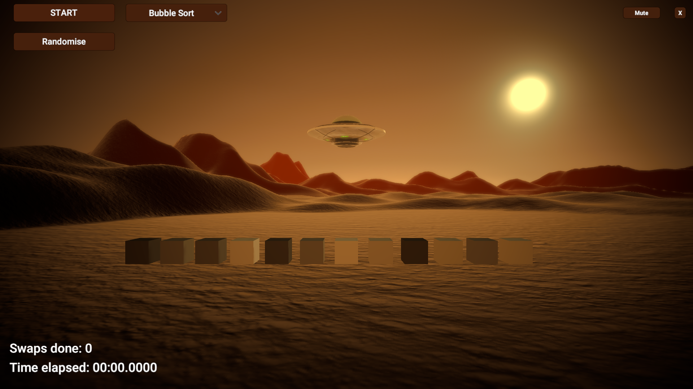

# Fifty Shades of Cubes

## Latest improvements
  * Recreated audio manager system
  * Fixed and updated UI

## Description
This simple 'game' shows visualisation of three sorting algorithms. A flying saucer hovering over the surface of Mars has one simple task: sort cubes by their shades, from the darkest to the brightest. The algorithms in questions are:
  * Bubble Sort
  * Cocktail Sort
  * Optimised Gnome Sort
## Algorithms overview
### Bubble Sort
Probably the simplest sorting algorithm. It iterates throught the collection swapping two adjacent elements if they are in wrong order.
```C#
for (int j = 0; j <= N - 2; j++)
{
    for (int i = 0; i <= N - 2; i++)
    {
        if(element[i] > element[i+1])
        {
            Swap(i, i+1);
        }
    }
}
```
### Cocktail Sort :cocktail:
Brother of the Bubble Sort. The previous one always traverses sorted collection in one direction. The cocktail sort traverses in both directions, switching by the end, like a olympic swimmer.
```C#
bool swapped = true;
int start = 0;
int end = N;

while(swapped)
{
      swapped = false;
      
      //one way...
      for(int i = start; i < end - 1; ++i)
      {
          if(element[i] > element[i+1])
          {
                    Swap(i, i+1);
                    swapped = true;
          }
       }

       if(swapped == false)
          break;

       end--;

       //...and back again
       for (int i = end - 1; i >= start; i--)
       {
          if(element[i] > element[i+1])
          {
                    Swap(i, i+1);
                    swapped = true;
          }
        }
}
```
### Gnome Sort
The Gnome Sort is named after a garden gnome sorting his flower pots. 
  * He looks at the flower pot next to him and the previous one; if they are in the right order he steps one pot forward, otherwise he swaps them and steps one pot backwards.
  * If there is no previous pot (he is at the starting of the pot line), he steps forwards; if there is no pot next to him (he is at the end of the pot line), he is done.

In this app I have used it's optimised version as outlined below:
```C#
void OptimisedGnomeSort()
{
        for(int i = 0; i < N; i++)
        {
           GnomeSort(i);
        }
}

void GnomeSort(int upperBound)
{
    int pos = upperBound;

    while (pos > 0 && element[pos - 1] > element[pos]))
    {
            Swap(pos, pos - 1);
            pos--;
    }
}
```

## Technical details
Detail | Value
------------ | -------------
Unity version  | 2020.3.0f1 Personal
Render Pipeline | URP
Time | August 2021

## External assets used
I have used the following free assets:
  * [Flying saucer model](https://www.cgtrader.com/free-3d-models/space/spaceship/free-flying-saucer) by jonlundy3d
  * [Sand texture](https://3dtextures.me/2017/03/23/sand-002/)

I have also used fantastic [DOTween library](http://dotween.demigiant.com/) for my animations.
